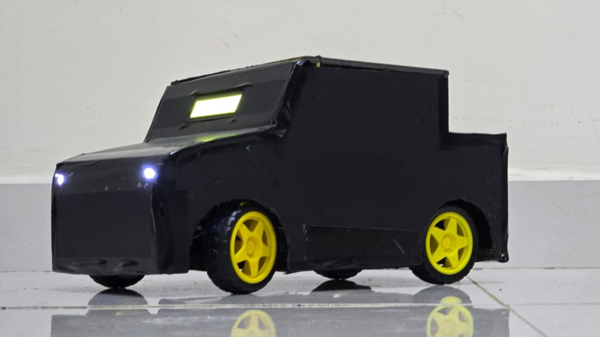
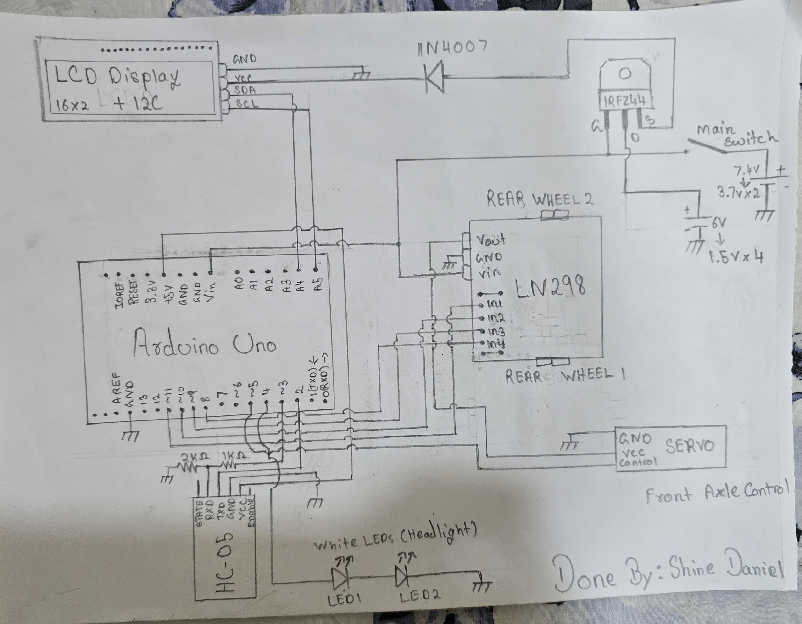
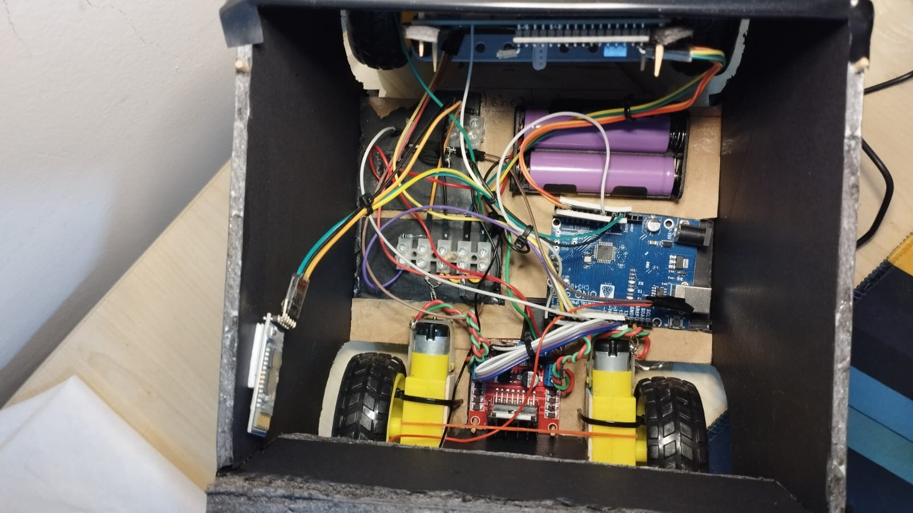
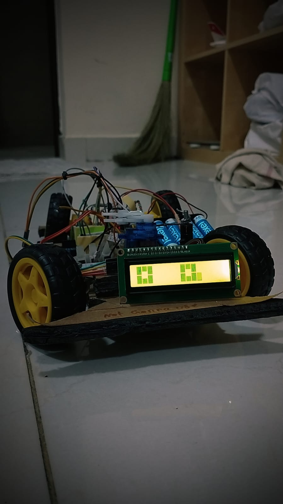

# 🚗 Bluetooth RC Car — Build Guide

> A fully hand-built Arduino-powered RC car with Bluetooth control, servo steering, animated LCD "eyes", headlights, and a custom cardboard chassis. Built by **Shine Daniel**.



---

## Table of Contents

1. [Overview](#overview)
2. [Features](#features)
3. [Components Required](#Components-Required)
4. [Circuit Diagram](#circuit-diagram)
5. [Chassis Construction](#chassis-construction)
6. [Wiring Guide](#wiring-guide)
7. [Arduino Code](#arduino-code)
8. [Bluetooth App Setup](#bluetooth-app-setup)
9. [Command Reference](#command-reference)
10. [How It Works](#how-it-works)
11. [Photos](#photos)
12. [Known Issues & Improvements](#known-issues--improvements)

---

## Overview

This project is a rear-wheel-drive RC car controlled over Bluetooth via a smartphone app avalible in the playstore called "BT-Car-controller". The front axle is steered by a servo motor, the rear wheels are driven by two DC motors through an L298N motor driver, and a 16x2 I2C LCD displays animated "eyes" that look in the direction the car is turning. The whole body is custom-built from cardboard and foam board.

---

## Features

- **Bluetooth control** via HC-05 module and any serial Bluetooth app
- **Rear-wheel drive** with two independent DC motors
- **Servo steering** on the front axle (Ackermann-style)
- **Animated LCD eyes** on a 16x2 I2C display that react to steering direction
- **Headlights** (white LEDs, switchable from app)
- **Cool lights** (extra LED strip, switchable from app)
- **Dual power supply**: 7.4V Li-ion (2S) for motors, 6V AA pack for logic/servo
- **MOSFET power switch** (IRFZ44) for the main motor supply
- **Hand-built cardboard body** — no 3D printer needed

---

## Components Required

| Component | Quantity | Notes |
|---|---|---|
| Arduino Uno | 1 | Main microcontroller |
| HC-05 Bluetooth Module | 1 | Serial Bluetooth, 9600 baud |
| L298N Motor Driver | 1 | Dual H-bridge |
| SG90 / MG90S Servo Motor | 1 | Front axle steering |
| TT DC Gear Motors | 2 | Rear wheels |
| Yellow TT Wheels (65mm) | 2 | Two rear driven, two front steered |
| 16×2 I2C LCD Display | 1 | Address 0x27 |
| IRFZ44N MOSFET | 1 | Main power switch for motor supply |
| 1N4007 Diode | 1 | Flyback protection on MOSFET gate |
| 18650 Li-ion Cells (3.7V) | 2 | Series → 7.4V for motors |
| AA Battery Holder (4×1.5V) | 1 | 6V for Arduino + servo |
| White LEDs | 2 | Headlights |
| LED Strip / Extra LEDs | 1 | Cool lights |
| 2kΩ Resistor | 1 | HC-05 RX voltage divider |
| 1kΩ Resistor | 1 | HC-05 RX voltage divider |
| Toggle Switch | 1 | Main power switch |
| Cardboard / Foam Board | — | Chassis and body |
| Jumper Wires | — | — |
| Hot Glue + Zip Ties | — | Assembly |

---

## Circuit Diagram



### Summary of connections

| Arduino Pin | Connected To |
|---|---|
| D2 (RX) | HC-05 TX |
| D3 (TX) | HC-05 RX (via 2kΩ/1kΩ voltage divider) |
| D4 | Headlight LEDs |
| D5 | Servo control wire |
| D6 | Cool lights (optional)|
| D8 | L298N IN4 |
| D9 | L298N IN3|
| D10 | L298N IN2 |
| D11 | L298N IN1 |
| A4 (SDA) | LCD SDA |
| A5 (SCL) | LCD SCL |
| 5V | HC-05 VCC, LCD VCC, Servo VCC (L298N Vout) |
| GND | Common ground |

**Power notes:**
- The two Lithum Ion cells in series provide ~7.4V to the L298N motor driver,IRFZ44(turning it on) and the Arduino Uno.
- Four AA batteries (4x1.5V = 6V) power the Arduino LCD only.
- An IRFZ44N MOSFET with a 1N4007 diode acts as the main supply for the LCd screen, the diode helps to reduce the 6V to a tolerable 5.3 for the LCD Screen.
- The HC-05 RX pin is 3.3V tolerant, so a voltage divider (2kΩ + 1kΩ) is used on the Arduino TX → HC-05 RX line to step 5V down to ~3.3V.

---

## Chassis Construction

The entire chassis and body is made from **corrugated cardboard and foam board**, cut and glued together.

### Base Plate (the body is completely ur preference, you can use a generic base bboard from a kit if you want, just note that the hardware will be same)
1. Cut a rectangular cardboard base (dimensions are ur wish, just note that the components should fit right inside).
2. Attach the two rear TT motors to the back corners using cardboard brackets/ziptie and hot glue. Make sure the motor shafts face outward symmetrically.
3. Mount the front axle assembly (servo + linkage rod + two front wheels) at the front. The servo rotates a crossbar that pushes/pulls the front wheel spindles to steer.(this part is probabl0y the most trickest in the entire project, if you can 3d print a axle system, which i believe you can find 3d model for in youtube or something, then do that )

### Front Steering Axle
The front axle uses a simple Ackermann-inspired setup:
- A servo is mounted centrally pointing sideways.
- The servo horn connects via a rigid wire/rod to a front axle beam.
- The front wheels are mounted on small spindles that pivot on the ends of the beam.
- Servo position 55° = straight, 30° = right, 80° = left. (the orientation might change depending on how you place it, so get a understanding of where the 0 of the servo is by running the sketch called steering_part)

### Electronics Mounting
- Arduino Uno is placed flat onto the base plate center.
- L298N motor driver sits next to the rear motors (see inside photo).
- Battery holders are placed for weight balance.
- LCD is mounted on the front face of the body, visible through a cut-out window.

### Body
The outer body is built from foam board / cardboard panels hot-glued into a boxy car shape:
- Two side walls + roof panel + front/rear panels.
- A windshield angle cut into the front panel holds the LCD.
- Everything is covered in black foam sheet for appearance.
- Headlight LEDs poke through two holes in the front panel.

---

## Wiring Guide

### Motor Driver (L298N)
```
L298N IN4  →  Arduino D8
L298N IN3  →  Arduino D9
L298N IN2  →  Arduino D10
L298N IN1  →  Arduino D11
L298N Vin  →  7.4V battery (+)
L298N GND  →  Common GND
L298N Vout →  Servo VCC
Motor A    →  Rear Left Motor
Motor B    →  Rear Right Motor

Note: place a capacitor(0.1uF) on both terminals (for both left and right side). this is to solve the back EMF issue that arises when we start/stop the motor suddenly
```

### HC-05 Bluetooth
```
HC-05 VCC    →  Arduino 5V
HC-05 GND    →  GND
HC-05 TX     →  Arduino D2
HC-05 RX     →  Arduino D3 via voltage divider
                 (D3 → 1kΩ → HC-05 RX, junction → 2kΩ → GND)
```

### Servo
```
Servo VCC     →  5V (from L298N Vout)
Servo GND     →  GND
Servo Signal  →  Arduino D5
```

### LCD (I2C)
```
LCD VCC  →  5.3V (from the diode and the 6V coming from the mosfet)
LCD GND  →  GND
LCD SDA  →  Arduino A4
LCD SCL  →  Arduino A5
```

### LEDs
```
Headlights (2× white LED in series) → D4 → LEDs → 220Ω → GND
Cool lights                          → D6 → LEDs/strip → GND
```

---

## Arduino Code

The project code lives in `main_code_trail1.ino`. It combines everything (motor control, servo, LCD, Bluetooth, lights) into one sketch.

### Libraries Required

Install these via the Arduino Library Manager (`Sketch → Include Library → Manage Libraries`):

- `LiquidCrystal I2C` by Frank de Brabander (provided in the repository)
- `Servo` (built-in)
- `SoftwareSerial` (built-in)
- `Wire` (built-in)
make sure to include the library in the IDE : sketch-> include library-> include Zip file 

### Key Pin Definitions (in the sketch)

```cpp
SoftwareSerial bluetoothSerial(2, 3); // RX=D2, TX=D3
int in1 = 11, in2 = 10, in3 = 9, in4 = 8; // L298N
int headlightpin = 4;
int coollightpin  = 6;
int servopin      = 5;
LiquidCrystal_I2C lcd(0x27, 16, 2);
```

> **Note:** If your I2C LCD has a different address (common alternatives: `0x3F`), change `0x27` in `LiquidCrystal_I2C lcd(0x27, 16, 2)` accordingly. You can find the address by running an I2C scanner sketch.

### Uploading

1. Connect Arduino to your PC via USB.
2. Open `main_code_trail1.ino` in the Arduino IDE.
3. Select **Board: Arduino Uno** and the correct **Port**.
4. Click **Upload**.
5. Disconnect the HC-05 RX/TX wires before uploading (they share the serial port and will cause upload errors if connected).

Note: You can test out of the components work how they are intended by running the programs for each on them separately with the respective components connected.
---

## Bluetooth App Setup

Use any Android Bluetooth serial terminal app. A popular free option that i used is **"BT Car Controller"** (available on the Play Store).

### Pairing the HC-05
1. Power on the car.
2. On your phone, go to **Settings → Bluetooth** and scan for devices.
3. Pair with **HC-05** (default PIN: `1234` or `0000`).

### App Configuration
If using a generic serial terminal app, send the single-character commands listed in the Command Reference below, terminated with a newline (`\n`).

If using "Bt Car Controller" app, configure the buttons to send the matching single letters.

---

## Command Reference

| Command Sent | Action |
|---|---|
| `F` | Forward |
| `B` | Backward |
| `S` | Stop |
| `R` | Steer Right (in place) |
| `L` | Steer Left (in place) |
| `G` | Forward + Right |
| `H` | Forward + Left |
| `I` | Backward + Right |
| `J` | Backward + Left |
| `U` | Headlights ON |
| `u` | Headlights OFF |
| `Z` | Cool lights ON |
| `z` | Cool lights OFF |

All commands are single ASCII characters followed by a newline (`\n`).

---

## How It Works

### Motor Control
The L298N dual H-bridge receives direction signals on IN1–IN4. Setting IN1 HIGH + IN2 LOW drives Motor A forward; reversing gives backward. Both motors run simultaneously since this is a rear-wheel-drive car — there is no independent left/right throttle (no PWM speed control in this version).

### Steering
A servo motor rotates to three positions:
- **55°** — straight ahead (center)
- **30°** — right turn
- **80°** — left turn

The servo horn mechanically links to the front axle to turn the front wheels.

### LCD Animated Eyes
On startup the LCD plays a "LETSSS GOOO!" message followed by an eye animation (blink + look left/right). During operation, the eyes shift horizontally on the LCD to match the steering direction — looking right when turning right, left when turning left, centered when going straight. This is achieved using 6 custom 5×8 pixel characters that together form each "eye".

### Power Architecture
The motors are power-hungry, so they run on a dedicated 7.4V Li-ion pack through the L298N. The Arduino and servo run on a separate 6V AA pack, preventing motor noise and voltage drops from resetting the microcontroller. The IRFZ44N MOSFET with a toggle switch gives a clean main power cutoff for the motor circuit.

---

## Photos

| Inside (with body) |  no chassis, with electronics |
|---|---|
|  |  |

---

## Known Issues & Improvements

- **No PWM speed control** — The car runs at full speed only. Adding `analogWrite` to the enable pins of the L298N would allow variable speed.
- **Cardboard durability** — The chassis is fragile. A future version could use a printed or laser-cut acrylic base.
- **Battery life** — Two 18650 cells drain quickly under load. Consider a larger capacity pack or LiPo.
- **No battery level indicator** — Adding a voltage divider on an analog pin and displaying voltage on the LCD would be a great addition.
- **HC-05 voltage divider** — The current 2kΩ/1kΩ divider gives ~3.3V from 5V Arduino TX, which is sufficient but a proper logic level converter would be cleaner.

---

## License

MIT License — feel free to use, modify, and build on this project. If you make something cool, share it!

This project is over when you ideas run out theres still 100s of things you can do/add to this - Stay Creative

---

*Built by Shine Daniel*
